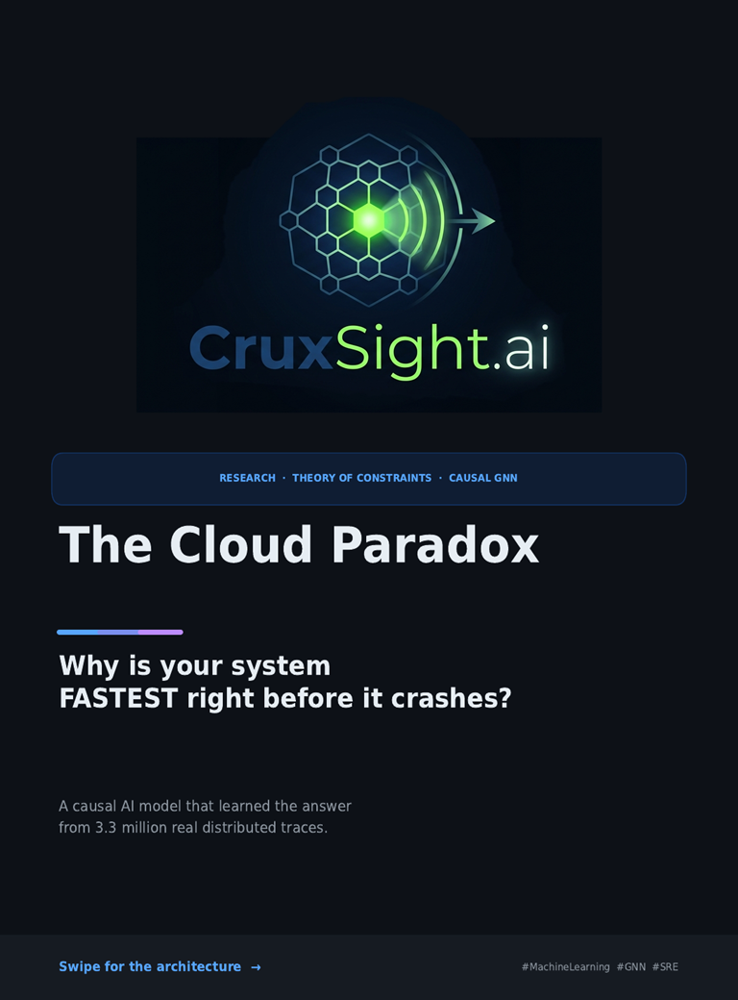
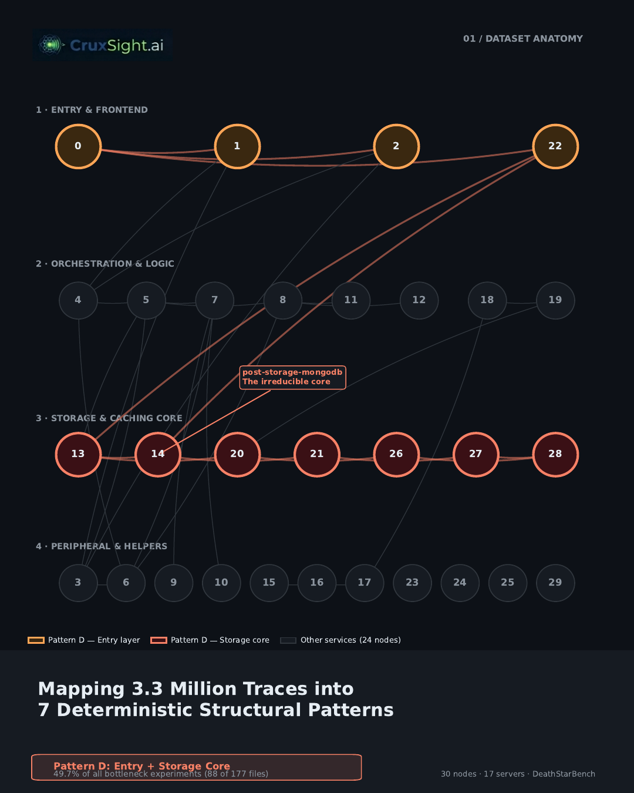

# CruxSight.ai

> **Causal Bottleneck Prediction for Microservices**
> Applying Theory of Constraints + Causal Graph Neural Networks to predict *and* explain system bottlenecks before they cause outages.

<p align="center">
  
  &nbsp;&nbsp;
  
</p>

---

## The Problem

Modern microservices systems can contain dozens of interdependent services. When a bottleneck forms, engineers face two questions simultaneously:

1. **Is a failure coming?** (detection)
2. **Which service is actually causing it?** (root-cause localization)

Existing tools answer these reactively — *after* the SLO breach. Existing AI approaches either detect anomalies without explaining them, or explain past failures without predicting future ones.

**CruxSight.ai does both, 3–5 minutes in advance, using only latency traces.**

---

## The Approach

CruxSight.ai combines two frameworks that have never been formally integrated before:

- **Theory of Constraints (ToC)** — Goldratt's framework for identifying the single limiting factor in any system. We formalize this as a graph-theoretic constraint, compute a *Resource Constraint Score (RCS)* per node, and use it to supervise the causal layer.
- **CST-GNN** (Causal Spatio-Temporal Graph Neural Network) — a three-stage architecture that processes latency time-series over the service call graph:

```
Raw Traces (Jaeger/Zipkin)
        │
        ▼
┌──────────────────────┐
│   Spatial Encoder    │  GAT layers, ToC-capacity-biased attention
│   (per time step)    │  → which services are under stress right now?
└──────────┬───────────┘
           │
           ▼
┌──────────────────────┐
│  Temporal Encoder    │  LSTM + Multi-head Attention (TFT-style)
│  (12-step window)    │  → is the stress pattern escalating over time?
└──────────┬───────────┘
           │
           ▼
┌──────────────────────┐
│  Causal Inference    │  NOTEARS-inspired DAG learning
│  Layer               │  → which service is CAUSING the others to slow down?
└──────────┬───────────┘
           │
           ▼
   4 Prediction Heads:
   • Bottleneck probability  (is a failure coming?)
   • Structural pattern      (Pattern A–G, which tier?)
   • Time-to-breach estimate (how many minutes?)
   • Root-cause ranking      (which service to fix first?)
```

**Key design principle:** The model is *N-agnostic* — the same trained weights work across graphs of different sizes (30 nodes and 7 nodes tested), with fine-tuning required only for the causal layer on new topologies.

---

## Dataset

**DeathStarBench Social Network** — PACE Lab, Stony Brook University
Collected July–October 2023, published with the GAMMA paper (WWW 2024).

| Property | Value |
|----------|-------|
| Total trace records | ~3.3 million |
| Processed CSV files | 196 |
| Microservices (compose workflow) | 30 nodes, 17 servers |
| Microservices (home workflow) | 7 nodes |
| Bottleneck types | CPU stress, Memory stress, Network throttle, Combined |
| Kubernetes workload levels | 200 / 400 / 800 RPS |

**Central finding from the 196-file analysis:**
Constraints in this system are **architectural, not resource-specific** — the same bottleneck subgraph (the irreducible storage core: nodes {13, 14, 20, 21, 26, 27, 28}) emerges regardless of whether the stress is CPU, memory, or combined. Latency is the reliable signal; resource metrics (CPU%, RAM%) add noise.

---

## The 7 Structural Patterns

Analysis of 177 valid files revealed 7 deterministic bottleneck structures:

| Pattern | Description | Count | % |
|---------|-------------|-------|---|
| **A** | Entry layer only | 28 | 15.8% |
| **B** | Storage core only | 9 | 5.1% |
| **C** | Middle tier only | 13 | 7.3% |
| **D** | Entry + Storage core (hybrid) | **88** | **49.7%** |
| **E** | Full cascade | 2 | 1.1% |
| **F** | Partial storage | 30 | 16.9% |
| **G** | Home workflow pattern | 7 | 4.0% |

Pattern D dominates — the entry gateway (nginx, node 0) and the storage core (7 MongoDB/Redis nodes) form the irreducible constraint in nearly half of all bottleneck events.

---

## Results

### Model Training (Compose Workflow, N=30)

4 ablation configurations were tested. Best result (Run 4):

| Metric | Value | Notes |
|--------|-------|-------|
| Val AUC | **0.869** | 5-fold validation |
| Pattern Accuracy | **88.9%** | 8-class taxonomy |
| CP Recall | **0.91–1.00** | vs 0.94 random baseline |
| Parameters | 205,617 | gat_hidden=32, tft_hidden=64 |

**Ablation summary:**

| Run | fn_weight | λ_causal | RCS_sup | Best AUC | CP Recall | Issue |
|-----|-----------|----------|---------|----------|-----------|-------|
| 1 | 5.0 | 0.20 | — | 0.827 | 0.84 | Probabilities saturated |
| 2 | 1.5 | 0.05 | — | 0.877 | 0.825 | RCS below random baseline |
| 3 | 5.0 | 0.20 | 0.3 | 0.824 | 0.94–0.99 | Val loss diverged |
| **4** | **1.5** | **0.05** | **0.3** | **0.869** | **0.91–1.00** | **Best — stable** |

The key insight from ablation: **calibration fixes and RCS supervision solve different problems** — combining them (Run 4) achieves both simultaneously.

### Generalization Study (Home Workflow, N=7)

Testing zero-shot transfer to a structurally different, unseen graph:

| Stage | AUC | RCS Top-1 | Notes |
|-------|-----|-----------|-------|
| Zero-shot | 0.544 | 0.0% | Total failure |
| Fine-tune: detection only (169 samples, 8 ep) | **0.900** | 0.0% | Detection recovers fast |
| Fine-tune: + RCS supervision (16 ep total) | **0.906** | **48.7%** | 1.7× random baseline (28.6%) |

**169 samples ≈ ~25 minutes of production traffic.**

Detection generalizes faster than root-cause localization — a practical deployment finding: systems can alert reliably almost immediately after fine-tuning, while root-cause ranking needs explicit pattern supervision and more epochs.

---

## Repository Structure

```
CruxSight.ai/
├── README.md
├── notebooks/
│   ├── analysis/              ← 196-file bottleneck analysis pipeline
│   └── cst_gnn_training.ipynb ← full training + ablation + generalization
├── src/
│   └── cst_gnn/
│       ├── model.py           ← CST-GNN architecture (GAT + TFT + NOTEARS)
│       ├── loss.py            ← TOCWeightedLoss + RCS supervision
│       ├── dataset.py         ← windowed trace loader
│       ├── toc_priors.py      ← ToC patterns A-G, critical path, capacity priors
│       ├── evaluate.py        ← AUC, PatAcc, CPRecall, subordination score
│       └── config.py          ← Config dataclass
├── results/
│   ├── ablation_table.json
│   ├── final_results.json
│   └── checkpoints/
│       ├── final_model_v1.pt           ← compose-trained (N=30)
│       └── final_model_v1_finetuned_home_v2.pt  ← fine-tuned (N=7)
├── docs/
│   ├── carousel/              ← LinkedIn hackathon slides (PNG + PDF)
│   └── vision/               ← architecture diagram, pattern visualizations
└── carousel/
    └── generate_carousel.py   ← reproduces the LinkedIn slides from real data
```

---

## Quick Start

```bash
git clone https://github.com/Maral-Alshanaa/CruxSight.ai
cd CruxSight.ai
pip install torch torch-geometric networkx scikit-learn numpy
```

**Run inference on a trace file:**
```python
# coming soon — scripts/predict.py
```

**Reproduce the carousel:**
```bash
python carousel/generate_carousel.py
# → outputs CruxSight_LinkedIn_Carousel.pdf + slide_*.png
```

**Training notebook:**
Open `notebooks/cst_gnn_training.ipynb` in Google Colab.
The dataset cache (~27MB) downloads automatically from the PACE Lab source on first run.

---

## Product Vision — Concept Dashboard (Mockups)

> ⚠️ **The screens below are early UI/UX concept mockups for the planned
> CruxSight.ai dashboard product. They illustrate the intended user
> experience and are *not* generated from live model output. All
> verified model results are in the [Results](#results) section above.**

<p align="center">
  
  &nbsp;
  
</p>
<p align="center">
  
  &nbsp;
  
</p>

The intended product flow:
1. **Topology view** — a capacity-biased graph of the live service mesh, with ToC constraint nodes highlighted by real-time GAT attention weights.
2. **Causal pattern anatomy** — when a bottleneck is detected, the dashboard highlights the causal subgraph (Pattern A–G) and the DAG learned by the causal inference layer.
3. **Cascading bottleneck view** — a full-system map showing which services are currently healthy, degrading, or critical, with a proactive alert panel.

These mockups guided the architecture's output design (the `bn_logit`, `pattern_logit`, `rcs`, and `ttb` heads map directly onto these UI elements) but represent a future productization target beyond the current research scope.

---

## Limitations & Future Work

- **Dataset scope:** Results are validated on DeathStarBench only. Generalization to production systems with different service topologies requires per-deployment fine-tuning (validated at ~25 min of data).
- **Root-cause localization at N=7:** RCS top-1 reaches 48.7% after 16 fine-tuning epochs — above the 28.6% random baseline but not yet at the detection-level performance (AUC 0.906). This gap between detection and localization convergence rates is an open question.
- **No Jaeger/Zipkin integration yet:** The prediction pipeline currently requires pre-processed CSV traces. A live streaming adapter (`scripts/predict.py`) is planned.
- **Pattern taxonomy is system-specific:** The 7 patterns (A–G) were derived from DeathStarBench. Other systems may exhibit different structural patterns requiring re-analysis.

- **RCS dominated by static capacity prior:** Analysis of inference
  outputs shows the top-ranked RCS nodes (and CPRecall) are heavily
  influenced by the fixed per-node TOC capacity prior rather than
  the sample-specific causal signal, which may explain why CPRecall
  remains close to its random baseline across all configurations.
  Future work could decouple these terms (e.g., normalize RCS by
  the capacity prior before ranking) to isolate the causal layer's
  learned contribution.
---

## Paper

**"Theory of Constraints-Driven Causal GNNs for Microservices Bottleneck Detection and Management"**
*Maral Alshanaa — 4th Year Graduation Project, 2026*

Full paper and academic write-up: coming soon.

---

## Dataset Citation

```bibtex
@dataset{deathstarbench2023,
  title   = {DeathStarBench Microservices Bottleneck Localization Dataset},
  author  = {PACE Lab, Stony Brook University},
  year    = {2023},
  note    = {Collected July–October 2023, published with GAMMA (WWW 2024)}
}
```

---

## License

MIT License — see [LICENSE](LICENSE) for details.

*Dataset: DeathStarBench is property of PACE Lab, Stony Brook University.
Model weights trained on this dataset are provided for research purposes only.*

---

<p align="center">
  <b>CruxSight.ai</b> — Find the constraint. Fix the system.<br/>
  Theory of Constraints-Driven Causal GNNs for Microservices Bottleneck Detection and Management<br/>
  Maral Alshanaa · 4th Year Graduation Project · 2026<br/>
  <a href="https://github.com/Maral-Alshanaa/CruxSight.ai">GitHub</a>
</p>
